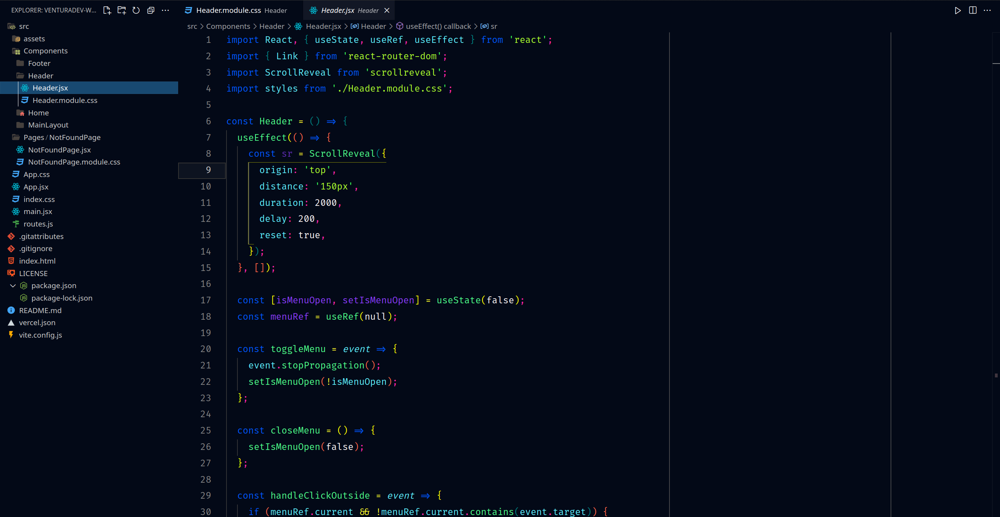

# The Best Night Theme

[Português](#the-best-night-theme-portugues) 🇧🇷

[English](#the-best-night-theme-english) 🇺🇸

# the-best-night-theme-portugues

## Português 🇧🇷

Este é um tema escuro personalizado para o Visual Studio Code, ideal para desenvolvimento noturno. O tema é projetado para ser fácil para os olhos, reduzindo a fadiga visual durante sessões prolongadas de codificação.

## Print

## Instalação

Você pode instalar este tema diretamente através do Visual Studio Code Marketplace.

## Contribuições

Contribuições são bem-vindas! Se você gostaria de ajudar a melhorar o tema, sinta-se à vontade para fazer um fork do repositório e enviar suas sugestões através de pull requests.

## Licença

Este tema é distribuído sob a licença MIT. Veja o arquivo `LICENSE` no repositório para mais detalhes.

# the-best-night-theme-english

## English 🇺🇸

# The Best Night Theme

This is a custom dark theme for Visual Studio Code, ideal for nighttime development. The theme is designed to be easy on the eyes, reducing eye strain during prolonged coding sessions.

## Screenshot

## Installation

You can install this theme directly through the Visual Studio Code Marketplace.

## Contributions

Contributions are welcome! If you would like to help improve the theme, feel free to fork the repository and submit your suggestions through pull requests.

## License

This theme is distributed under the MIT license. See the `LICENSE` file in the repository for more details.
